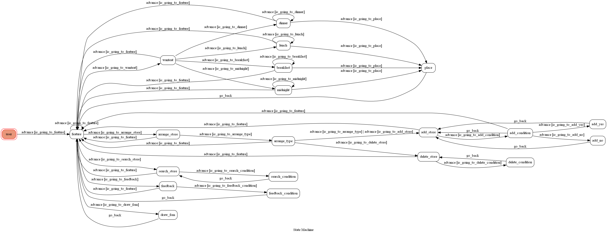

# TOC Project 2020

[](https://codeclimate.com/github/NCKU-CCS/TOC-Project-2020/maintainability)

[](https://snyk.io/test/github/NCKU-CCS/TOC-Project-2020)


Template Code for TOC Project 2020

A Line bot based on a finite state machine

More details in the [Slides](https://hackmd.io/@TTW/ToC-2019-Project#) and [FAQ](https://hackmd.io/s/B1Xw7E8kN)

## Setup

### Prerequisite
* Python 3.6
* Pipenv
* Facebook Page and App
* HTTPS Server

#### Install Dependency
```sh
pip3 install pipenv

pipenv --three

pipenv install

pipenv shell
```

* pygraphviz (For visualizing Finite State Machine)
    * [Setup pygraphviz on Ubuntu](http://www.jianshu.com/p/a3da7ecc5303)
	* [Note: macOS Install error](https://github.com/pygraphviz/pygraphviz/issues/100)


#### Secret Data
You should generate a `.env` file to set Environment Variables refer to our `.env.sample`.
`LINE_CHANNEL_SECRET` and `LINE_CHANNEL_ACCESS_TOKEN` **MUST** be set to proper values.
Otherwise, you might not be able to run your code.

#### Run Locally
You can either setup https server or using `ngrok` as a proxy.

#### a. Ngrok installation
* [ macOS, Windows, Linux](https://ngrok.com/download)

or you can use Homebrew (MAC)
```sh
brew cask install ngrok
```

**`ngrok` would be used in the following instruction**

```sh
ngrok http 8000
```

After that, `ngrok` would generate a https URL.

#### Run the sever

```sh
python3 app.py
```

#### b. Servo

Or You can use [servo](http://serveo.net/) to expose local servers to the internet.


## Finite State Machine


## Usage
The initial state is set to `user`.

Every time `user` state is triggered to `advance` to another state, it will `go_back` to `user` state after the bot replies corresponding message.

* user
	* Input:"start"
		* State:feature
		* Reply:三個按鈕(Carousel template) 1.想吃吃！ 2.查詢店家資訊！ 3.新增/刪除店家列表
			* Input:選擇按鈕 "想吃吃！"
				* State:wanteat
				* Reply:想吃什麼呢？點選後將隨機推薦店家！
				* Reply:四個按鈕(Buttons template) 1.早餐 2.午餐 3.晚餐 4.宵夜
					* Input:選擇按鈕 "早餐"
						* State:breakfast
						* Reply:店家名稱、地址、照片
						* Reply:兩個按鈕(Buttons template) 1.獲取店家資訊！ 2.換一家！
							* Input:選擇按鈕 "獲取店家資訊！"
								* State:place
								* Reply:店家名稱、地址、電話、營業時間、價位等級、評價等級、GoogleMap連結(回到feature state)
							* Input:選擇按鈕 "換一家！"
								* State:breakfast
							* Input:"回到主選單"
								* State:feature
					* Input:選擇按鈕 "午餐"
						* State:lunch
						* Reply:店家名稱、地址、照片
						* Reply:兩個按鈕(Buttons template) 1.獲取店家資訊！ 2.換一家！
							* Input:選擇按鈕 "獲取店家資訊！"
								* State:place
								* Reply:店家名稱、地址、電話、營業時間、價位等級、評價等級、GoogleMap連結(回到feature state)
							* Input:選擇按鈕 "換一家！"
								* State:lunch
							* Input:"回到主選單"
								* State:feature
					* Input:選擇按鈕"晚餐"
						* State:dinner
						* Reply:店家名稱、地址、照片
						* Reply:兩個按鈕(Buttons template) 1.獲取店家資訊！ 2.換一家！
							* Input:選擇按鈕 "獲取店家資訊！"
								* State:place
								* Reply:店家名稱、地址、電話、營業時間、價位等級、評價等級、GoogleMap連結(回到feature state)
							* Input:選擇按鈕 "換一家！"
								* State:dinner
							* Input:"回到主選單"
								* State:feature
					* Input:選擇按鈕 "宵夜"
						* State:midnight
						* Reply:店家名稱、地址、照片
						* Reply:兩個按鈕(Buttons template) 1.獲取店家資訊！ 2.換一家！
							* Input:選擇按鈕 "獲取店家資訊！"
								* State:place
								* Reply:店家名稱、地址、電話、營業時間、價位等級、評價等級、GoogleMap連結(回到feature state)
							* Input:選擇按鈕 "換一家！"
								* State:midnight
							* Input:"回到主選單"
								* State:feature
					* Input:"回到主選單"
						* State:feature
			* Input:選擇按鈕 "查詢店家資訊！"
				* State:search_store
				* Reply:請輸入店家名稱、格式、範例
					* Input:店家名稱
						* State:search_condition
						* 檢查用戶輸入的店家是否為有效店家
						* if 店家有效:
							* Reply:店家名稱、地址、電話、營業時間、價位等級、評價等級、GoogleMap連結(回到search_store state)
						* if 店家無效:
							* Reply:"找不到此店家，請重新輸入！"(回到search_store state)
					* Input:"回到主選單"
						* State:feature
			* Input:選擇按鈕 "新增/刪除店家列表"
				* State:arrange_store
				* Reply:請選擇欲新增/刪除的店家分類，點選後將顯示店家列表
				* Reply:四個按鈕(Buttons template) 1.早餐 2.午餐 3.晚餐 4.宵夜
					* Input:選擇按鈕 "早餐", "午餐", "晚餐", "宵夜"
						* State:arrange_type
						* Reply:該用戶對應的店家列表
						* Reply:兩個按鈕(Confirm Template) 1.新增店家 2.刪除店家
							* Input:選擇按鈕 "新增店家"
								* State:add_store
								* Reply:請輸入店家名稱、格式、範例
									* Input:店家名稱
										* State:add_condition
										* 檢查用戶輸入的店家是否為有效店家, 或是否已經存在列表內
										* if 店家有效:
											* Reply:店家名稱、地址、電話、營業時間、價位等級、評價等級、GoogleMap連結
											* Reply:是否加入該店家至店家列表？ 兩個按鈕(Confirm Template) 1.是 2.否
												* Input:選擇按鈕 "是"
													* State:add_yes
													* Reply:"加入完成！"(回到add_store state)
												* Input:選擇按鈕 "否"
													* State:add_no
													* Reply:"加入失敗！"(回到add_store state)
												* Input:"回到主選單"
													* State:feature
										* if 店家無效:
											* Reply:"找不到此店家，請重新輸入！"(回到add_store state)
										* if 店家已存在:
											* Reply:"此店家已存在列表內，請重新輸入！"(回到add_store state)
									* Input:"回到主選單"
										* State:feature
							* Input:選擇按鈕 "刪除店家"
								* State:delete_store
								* Reply:請輸入店家名稱、格式、範例
									* Input:店家名稱
										* State:delete_condition
										* 檢查用戶輸入的店家是否存在列表內, 或者為系統預設店家
										* if 店家存在:
											* Reply:"刪除完成！"(回到delete_store state)
										* if 店家不存在:
											* Reply:"列表內無此店家，請重新輸入！"(回到delete_store state)
										* if 店家為系統預設店家:
											* Reply:"此店家為系統預設店家故無法刪除，請重新輸入！"(回到delete_store state)
									* Input:"回到主選單"
										* State:feature
							* Input:"回到主選單"
								* State:feature
					* Input:"回到主選單"
						* State:feature
			* Input:"回到主選單"
				* State:feature
## Deploy
Setting to deploy webhooks on Heroku.

### Heroku CLI installation

* [macOS, Windows](https://devcenter.heroku.com/articles/heroku-cli)

or you can use Homebrew (MAC)
```sh
brew tap heroku/brew && brew install heroku
```

or you can use Snap (Ubuntu 16+)
```sh
sudo snap install --classic heroku
```

### Connect to Heroku

1. Register Heroku: https://signup.heroku.com

2. Create Heroku project from website

3. CLI Login

	`heroku login`

### Upload project to Heroku

1. Add local project to Heroku project

	heroku git:remote -a {HEROKU_APP_NAME}

2. Upload project

	```
	git add .
	git commit -m "Add code"
	git push -f heroku master
	```

3. Set Environment - Line Messaging API Secret Keys

	```
	heroku config:set LINE_CHANNEL_SECRET=your_line_channel_secret
	heroku config:set LINE_CHANNEL_ACCESS_TOKEN=your_line_channel_access_token
	```

4. Your Project is now running on Heroku!

	url: `{HEROKU_APP_NAME}.herokuapp.com/callback`

	debug command: `heroku logs --tail --app {HEROKU_APP_NAME}`

5. If fail with `pygraphviz` install errors

	run commands below can solve the problems
	```
	heroku buildpacks:set heroku/python
	heroku buildpacks:add --index 1 heroku-community/apt
	```

	refference: https://hackmd.io/@ccw/B1Xw7E8kN?type=view#Q2-如何在-Heroku-使用-pygraphviz

## Reference
[Pipenv](https://medium.com/@chihsuan/pipenv-更簡單-更快速的-python-套件管理工具-135a47e504f4) ❤️ [@chihsuan](https://github.com/chihsuan)

[TOC-Project-2019](https://github.com/winonecheng/TOC-Project-2019) ❤️ [@winonecheng](https://github.com/winonecheng)

Flask Architecture ❤️ [@Sirius207](https://github.com/Sirius207)

[Line line-bot-sdk-python](https://github.com/line/line-bot-sdk-python/tree/master/examples/flask-echo)
